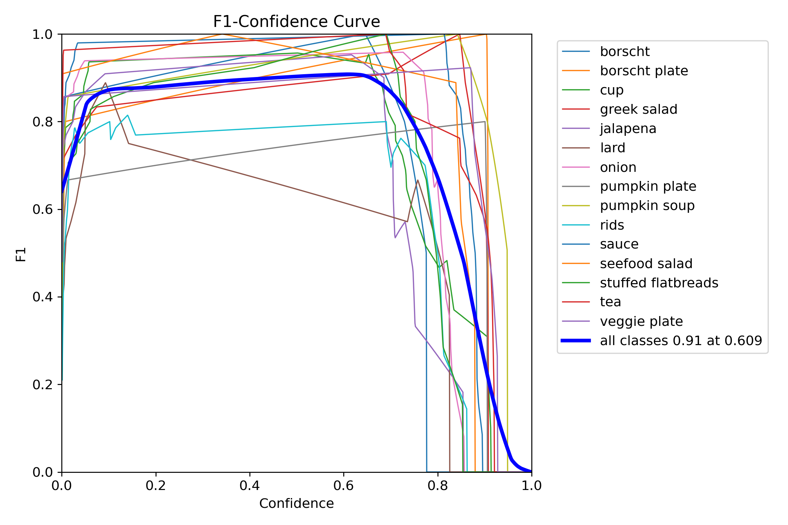
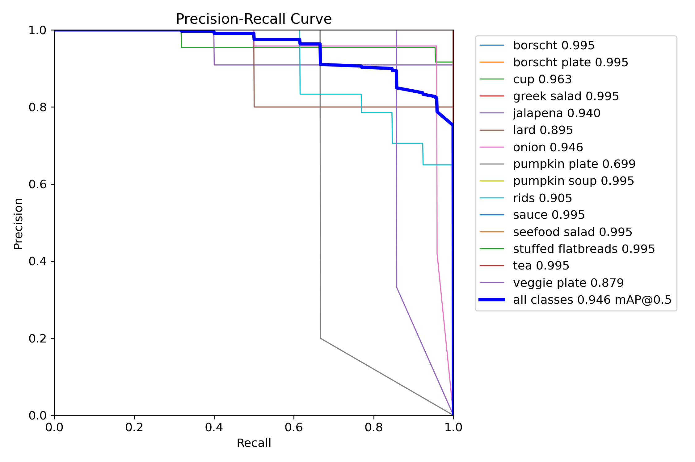
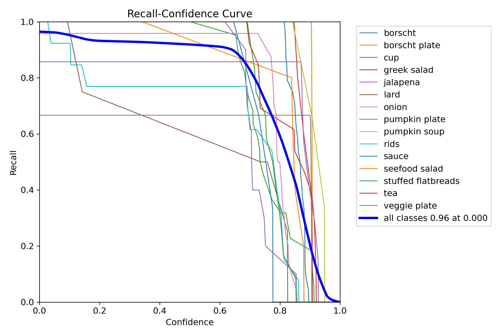
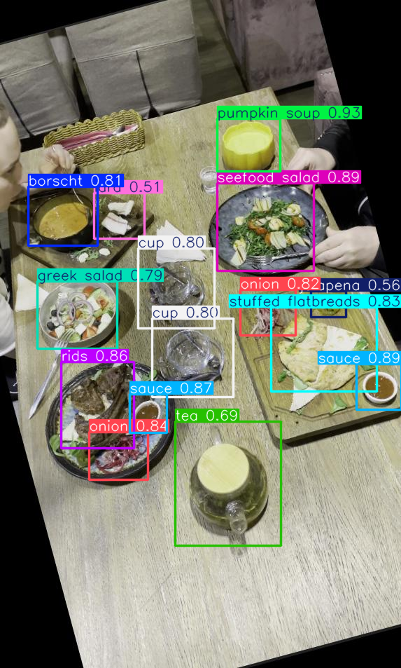
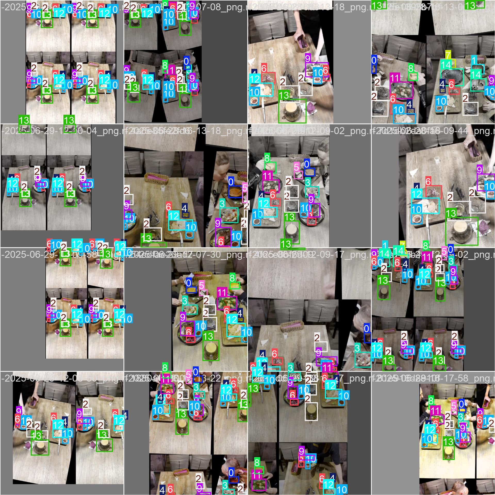

# Позиция: Python Developer (Computer Vision, ML)
## Задача: Детекция блюд и пустых тарелок на видео с помощью YOLOv11
## 1. Описание задачи
Цель задания — обучить модель компьютерного зрения, которая:

Обнаруживает различные блюда на столе (стейк, салат, суп и др.)
Распознаёт пустые тарелки после того, как еда была съедена.

Использованная модель: YOLOv11m

## Этапы работы:
### Сбор и разметка данных 
Видео скачано с Яндекс.Диска. Кадры извлекались вручную для точечного отбора репрезентативных сцен. Для автоматизации в будущем можно использовать cv2.VideoCapture (например, с шагом в N секунд), на давнный момент не пользовалась. 
Загрузила на Roboflow изображения и произвела разметку блюд и тарелок,с указанием необходимых классов: 

Классы:
0: borscht
1: borscht plate
2: cup
3: greek salad
4: jalapena
5: lard
6: onion
7: pumpkin plate
8: pumpkin soup
9: rids
10: sauce
11: seefood salad
12: stuffed flatbreads
13: tea
14: veggie plate

После того как Dataset готов, добавила немного аугментацию: Flip: Horizontal (отображение по горизонтали), Rotation: Between -15° and +15° (поворот на случаный угол), Hue: Between -15° and +15° (устойчивость к изменению цвета). Таким образом было увеличино количество данных до 148 штук. Конечно всё таки данных маловато, но уже лучше.

Разбиение на train/val/test. Данные были разделены следующим образом: Train: 70% (129 изображения), Validation: 20% (13 изображений), Test: 10% (6 изображений). Разбиение выполнялось автоматически в Roboflow с сохранением баланса классов. Такой подход обеспечивает: достаточный объем данных для обучения, контроль переобучения на валидационной выборке, финализацию оценки на тестовом наборе, который модель не видела во время обучения.
   
### Приступаем к написанию кода. 
Вставила фрагмент из библиотеки моделей Roboflow, чтобы загрузить и распаковать подготовленный набор данных. Я решила добавить еще здесь аугментацию (изменение яркости при разном освещении, легкое размытие, мелкие сдвиги). Это необходимо для увеличения датасета и повышения обобщающей способности модели.

### Обучение модели. 
Указываю основные параметры: количество эпох, размер изображения, размер батча.
epochs=50,
imgsz=640,
batch=16.
Автоматический выбор гиперпараметров: Learning rate низкий (~0.0005), Weight decay маленький (~0.0005).

### Метрики.
После обучения модель показала отличные результаты: высокая точность детекции, хорошая стабильность при разных условиях освещения и ракурсах.Такие выводы мы можем сделать на основании метрик:
mAP50: 0.941  - модель почти всегда точно находит объекты и правильно их локализует.
mAP50-95: 0.613 - показывает, что модель в целом хорошо локализует объекты , хотя не идеально, определяет положение объекта.
Precision: 0.905 - модель редко ошибается , когда говорит, что нашла объект.
Recall: 0.910 - важно не упустить ни одно блюдо.
F1-score: 0.908 -учитывает баланс между тем, как много мы находим и как мало ошибаемся.
Модель в целом сбалансирована : она и находит всё, что нужно, и редко ошибается.

### Визуализация метрик

### Провела итерацию оптимизации гиперпараметров.
Вручную настроила гиперпараметры.
Learning rate (0.01) - высокий,  Weight decay маленький (0.05) - тоже увеличила, Добавлен Dropout (0.2), добавила еще Epochs до 70.
Еще раз обучила модель.

###  Сравнение двух моделей
            Initial  Optimized
mAP50      0.941260   0.928760
mAP50-95   0.612500   0.594390
Precision  0.905250   0.885190
Recall     0.909940   0.903030
F1-score   0.907589   0.894021

Recall остался почти на том же уровне: 0.910 - 0.903
F1-score немного снизился: 0.908  - 0.894
Это говорит о том, что модель стала чуть более консервативной, она находит чуть меньше объектов , но делает это с большей уверенностью .В итоге меньше переобучения, ниже точность.
mAP50 и mAP50-95 упали немного (у первой лучший mAP, но возможное переобучение).
Precision упал с 0.905 до 0.885.
F1-score тоже немного снизился.
Это может быть связано с тем, что:
добалена сильная регуляризация (weight_decay=0.05).
добаавлен dropout=0.2 , который "выключает" часть нейронов.
Увеличен learning rate , что могло привести к расхождению на последних эпохах.

### Тестирование на изображении
Так как первая модеель показала лучшие результаты, проведем тестирование изображения на данной моедели. Модель стабильно распознаёт объекты на любом изображении.

### Тестирование на видео
Для проверки работоспособности модели в динамике была протестирована работа на видеофайле. Модель стабильно обнаруживает объекты (блюда и пустые тарелки) по кадрам, рисует bounding boxes и корректно классифицирует объекты даже при изменении ракурса и освещения. Файл прилагается - output_video.mp4

###  Анализ ошибок
##### Что работает хорошо:
Высокая точность детекции.
Устойчивость к разному освещению.
Хорошее обобщение на новых данных.
#####  Что можно улучшить:
При перекрытии объектов возможны ошибки.
Нужно больше данных с разных ракурсов.

##### Возможные улучшения:
Добавление дополнительных аугментаций, например: CLAHE, RandomGamma, CoarseDropout.
Увеличение датасета. хотелось бы  добавить ещё видео или использовать авто-экстракцию кадров.
Использование более крупной модели yolo11l.pt или yolo11x.pt.
Финетюнинг гиперпараметров: weight_decay, lr0, dropout.

### Выводы
Обученная мной модель показала отличную работу как на изображениях, так и на видео. Она уверенно обнаруживает разнообразные блюда и пустые тарелки, сохраняя точность и скорость работы. Можно использовать эту модель в реальных условиях, например, для анализа камер в ресторанах, автоматического подсчёта оставшихся блюд и анализа поведения клиентов.
Все этапы выполнены вручную.
Код читаемый  с пояснениями.
Представлены графики и отчет.